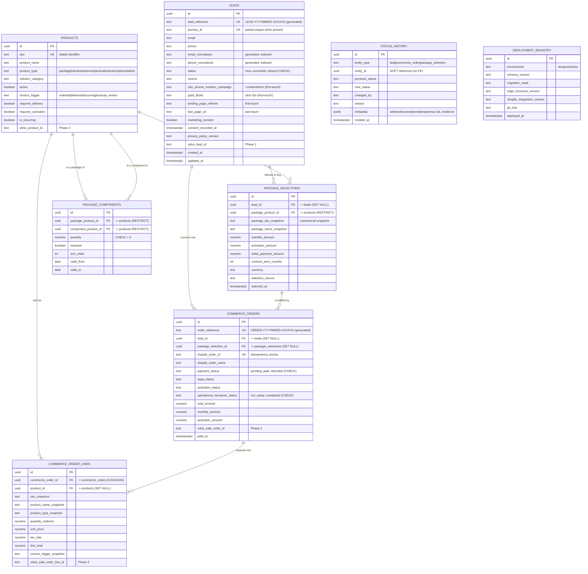
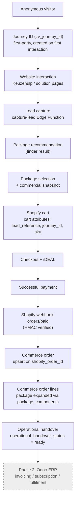
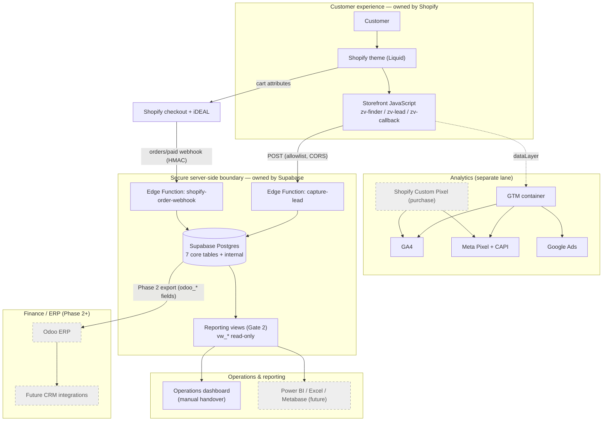
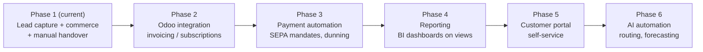

# Zo Veilig Commerce — Reference Architecture

**Status:** Phase 1, post Gate 1 · **Schema version:** 1.0.0 · **Last updated:** 2026‑07‑29
**Audience:** business stakeholders, operations, developers, Shopify specialists, Supabase developers, ERP integration partners.

> This document is the long‑term reference architecture for the Zo Veilig Commerce platform. It is written to be understood without prior context. Diagrams are Mermaid so they render directly in GitHub/Markdown and stay version‑controlled next to the code.

---

## 1. Executive summary

Zo Veilig sells connected‑care and home‑security **packages** (Langer Thuis, Mijn Thuis, Veilig Onderweg). A package is not a single product — it expands into hardware, an activation fee and a recurring service.

The platform separates three concerns deliberately:

- **Shopify** owns the *customer experience and the sale* (storefront, Keuzehulp, cart, checkout, iDEAL payment).
- **Supabase** owns the *operational truth* — leads, attribution, what was selected, the commerce order, its expanded order lines, status history and audit — and is the secure server‑side boundary.
- **Odoo** (Phase 2) will own *ERP/finance* (invoicing, subscriptions, fulfilment). Every table already carries `odoo_*` columns so this is a forward‑compatible extension, not a rebuild.

Phase 1 delivers an anonymous‑to‑converted journey that is fully attributable and auditable, ends in a **manual operational handover** (no Odoo yet), and never exposes a secret to the browser. Gate 1 (the database foundation) is complete on a dedicated DEV project built entirely from version‑controlled migrations.

---

## 2. Architecture principles

1. **Separation of ownership.** Each system owns one thing well; no system is forced to be a CRM/ERP it isn't.
2. **Repository is the source of truth.** Every environment is reproducible from Git → migrations → DEV → Production. Production is never the canonical schema.
3. **Secure server‑side boundary.** The storefront never holds a service‑role key and never writes to protected tables directly; all writes go through Supabase Edge Functions.
4. **Deny by default.** RLS is enabled on every table with no policies, so only the RLS‑exempt `service_role` (used only inside Edge Functions) can read/write.
5. **Idempotency everywhere money is involved.** Paid‑order processing is safe under webhook retries.
6. **Snapshot the commercials.** Prices/SKUs/names are captured at the moment of selection and order, so later catalogue changes never rewrite history.
7. **Audit the important transitions.** `status_history` records who/what/why for every meaningful state change.
8. **Data minimisation & consent.** PII is minimised, consent is recorded, logs are redacted, marketing attribution is consent‑aware.
9. **Gated delivery.** Four approval gates; nothing proceeds without explicit sign‑off.

---

## 3. Entity Relationship Diagram (ERD)

### 3.1 Diagram

`STATUS_HISTORY` and `internal.DEPLOYMENT_REGISTRY` intentionally have **no foreign keys** — `status_history` uses a soft `(entity_type, entity_id)` reference so it can audit any entity without coupling, and the registry is deployment metadata, not business data.

### 3.2 Every relationship, typed, with the reason it exists

| From → To | Cardinality | On delete | Why it exists |
|---|---|---|---|
| **Lead → Package Selection** | one‑to‑many | SET NULL | Stores what the visitor intended to purchase before payment; one person can consider several packages over time. |
| **Lead → Commerce Order** | one‑to‑many | SET NULL | Links a paid order back to the person/journey that produced it; a household can place more than one order. |
| **Product (as package) → Package Component** | one‑to‑many | RESTRICT | Defines the bill‑of‑materials: which components make up a package. RESTRICT prevents deleting a product still used in a package. |
| **Product (as component) → Package Component** | one‑to‑many | RESTRICT | The same product (e.g. a sensor) can be a component of many packages. |
| **Product → Package Selection** | one‑to‑many (many‑to‑one from the selection side) | RESTRICT | Resolves the chosen package by stable SKU to a real catalogue row; you can't select a product that doesn't exist. |
| **Product → Commerce Order Line** | one‑to‑many | SET NULL | Each expanded order line points to the catalogue product it represents; if a product is later removed the historical line survives (snapshot columns keep the facts). |
| **Package Selection → Commerce Order** | one‑to‑many (typically one‑to‑one in practice) | SET NULL | Carries the pre‑payment intent (and its commercial snapshot) onto the actual order. |
| **Commerce Order → Commerce Order Line** | one‑to‑many | CASCADE | A package **expands** into operational lines (hub, sensors, activation, service). CASCADE keeps lines and their order together. |
| **Status History → (any entity)** | many‑to‑one (soft) | n/a | One audit trail table records status transitions for leads, orders and selections without hard coupling. |

### 3.3 Table categories

| Table | Category | Why |
|---|---|---|
| `leads` | **Aggregate root** (transactional) | The anonymous‑to‑known journey aggregate; owns identity, attribution, consent and lifecycle status. |
| `commerce_orders` | **Aggregate root** (transactional) | The order aggregate; owns payment/handover state and is the parent of its order lines. |
| `products` | **Aggregate root / lookup** (reference) | The catalogue aggregate; the stable SKU source everything else resolves against. |
| `package_components` | **Lookup / reference** | The bill‑of‑materials definition (which components + quantities make a package). Configuration, not per‑customer data. |
| `package_selections` | **Transactional** | A per‑visitor intent event with a commercial snapshot. |
| `commerce_order_lines` | **Transactional** | The expanded, snapshotted lines of a paid order. |
| `status_history` | **Audit** | Immutable evidence of state transitions (who/what/why/when). |
| `internal.deployment_registry` | **Audit (operational metadata)** | Records each environment deployment's versions + git SHA; not business data, private schema. |

---

## 4. Customer journey data flow

> This is a **business lifecycle** view, not a schema view. It shows what data exists, who owns it, what is created vs updated, and what must never be overwritten.

### 4.1 Stage‑by‑stage ownership

| Stage | Data that exists | Owned by (system) | Created | Updated | Never overwrite |
|---|---|---|---|---|---|
| Anonymous visitor | none persisted | Browser | — | — | — |
| **Journey ID** | `zv_journey_id` (first‑party) | Storefront → `leads.journey_id` | on first interaction | travels with every request; into cart attributes | the journey id itself (first‑touch) |
| Website interaction | page context, attribution params | Storefront (dataLayer) | — | — | — |
| **Lead capture** | `leads` row + `lead_reference` | Supabase (via `capture-lead`) | lead + `status_history` | enrichment (fill‑if‑empty) | `journey_id`, `source`, UTM, click IDs, `landing_page`, `referrer`, `first_page_url`, `created_at` |
| Package recommendation | recommended package (in memory) | Storefront/finder | — | — | — |
| **Package selection** | `package_selections` row + snapshot | Supabase | new selection row (append) | never mutated | the snapshot (`package_sku/name_snapshot`, amounts) |
| Shopify cart | cart attributes | Shopify | cart attributes | `last_page_url` | references carried in attributes |
| Checkout / payment | Shopify order | Shopify | order | financial status | — |
| **Shopify webhook** | raw order + attributes | Shopify → Supabase | — | — | — |
| **Commerce order** | `commerce_orders` row | Supabase | upsert (once per `shopify_order_id`) | payment/handover state (forward‑only) | `order_reference`, `shopify_order_id`, `paid_at` |
| **Commerce order lines** | expanded lines | Supabase | one line per product (idempotent) | quantities on retry | snapshot columns |
| **Operational handover** | `operational_handover_status` | Supabase / Operations | — | `not_ready → ready → in_progress → completed` | historical `status_history` |
| Future Odoo | `odoo_*` fields | Odoo (Phase 2) | ERP records | `odoo_*` sync fields | Phase‑1 commerce facts |

### 4.2 Where each identifier begins and ends

- **First‑touch attribution** — begins at the first `capture-lead` write (UTM, click IDs, landing/referrer/first_page); **never** overwritten thereafter. Ends conceptually when the lead is deleted/anonymised.
- **Last‑touch attribution** — `last_page_url` and enrichment; updated on each interaction; ends with the lead.
- **Journey ID** — begins in the browser on first interaction; persists in first‑party storage; flows into `leads.journey_id` and into the Shopify cart/order attributes; ends when the browser storage is cleared or the lead lifecycle ends. It is a correlation key, **not** authentication.
- **Lead Reference** — begins when the `leads` row is created (`generate_reference('LEAD')`); the durable business handle across storefront, checkout and operations; ends with the lead.
- **Shopify Order** — begins at successful payment in Shopify; the commercial/payment source of record; feeds the webhook.
- **Operational (Commerce) Order** — begins when the webhook creates the `commerce_orders` row; owns the operational lifecycle and handover; hands off to Odoo in Phase 2.
- **Status History** — begins at the first transition it records; append‑only; never ends (audit evidence retained per the retention policy).

---

## 5. Solution architecture

**System ownership map**

| Concern | Owner |
|---|---|
| Customer experience | **Shopify** (theme, Keuzehulp, cart) |
| Commerce (sale + payment) | **Shopify** (checkout, iDEAL) |
| Lead data & attribution | **Supabase** |
| Operational workflow (order → handover) | **Supabase** + Operations |
| Reporting | **Supabase views** → BI tools |
| Finance / invoicing | **Odoo (Phase 2)** |
| ERP / subscriptions / fulfilment | **Odoo (Phase 2)** |
| Analytics | **GTM / GA4 / Meta / Google Ads** (+ Shopify Custom Pixel for purchase) |

---

## 6. Table ownership (who writes / reads / never writes / never reads)

| Table | Writes | Reads | Must NEVER write | Must NEVER read | Why |
|---|---|---|---|---|---|
| `leads` | `capture-lead`, `shopify-order-webhook` (via `service_role`) | Edge Functions; reporting views | Storefront/browser; `anon`; `authenticated` | Storefront/browser (PII) | Contains PII; only the secure boundary may touch it. RLS denies `anon`/`authenticated`. |
| `products` | Ops/admin tooling (`service_role`) | Edge Functions; reporting | Storefront; webhooks (catalogue is not order‑time data) | — (non‑PII) | Reference catalogue; changed by controlled tooling, not by customer flows. |
| `package_components` | Ops/admin tooling | Edge Functions (expansion); reporting | Storefront; webhooks | — | BOM configuration; only ops defines it. |
| `package_selections` | `capture-lead` | Edge Functions; `shopify-order-webhook`; reporting | Storefront/browser directly | Storefront | Per‑visitor intent + snapshot; written server‑side only. |
| `commerce_orders` | `shopify-order-webhook`; Ops (handover) | Edge Functions; Ops dashboard; reporting | Storefront; `anon` | Storefront/browser | Financial + operational state; only webhook + ops. |
| `commerce_order_lines` | `shopify-order-webhook` | Edge Functions; Ops; reporting | Storefront; anything at checkout time | Storefront | Expanded operational detail; webhook‑owned. |
| `status_history` | Edge Functions; Ops tooling | Edge Functions; reporting; audit | Storefront; `anon` | Storefront | Audit integrity; append‑only via server side. |
| `internal.deployment_registry` | Deployment tooling (`service_role`) | Platform/DevOps | Storefront; `anon`; `authenticated` | Storefront; `anon`; `authenticated` | Deployment metadata in a private, non‑Data‑API schema. |

Enforcement today: **RLS enabled, no policies** ⇒ `anon`/`authenticated` are denied on every table; `service_role` (used only inside Edge Functions and tooling) is the sole accessor. The storefront never holds `service_role`.

---

## 7. Architectural decisions

- **Why Shopify is not the CRM.** Shopify is excellent at storefront + checkout + payment, but weak as an operational CRM/ERP (limited relational modelling, no bill‑of‑materials, no operational workflow states). Forcing it to be the CRM would couple operations to a system we don't control and can't migrate cleanly.
- **Why Supabase owns operational data.** We need relational integrity, constraints, transactions, RLS, and SQL reporting over leads/orders/lines/audit. Postgres gives us that plus a secure server‑side boundary (Edge Functions + service role).
- **Why Odoo is delayed until Phase 2.** Introducing ERP now would add scope, cost and risk before the commerce journey is proven. Every table already carries `odoo_*` fields, so ERP is an extension, not a rewrite. Phase 1 ends in a *manual* handover.
- **Why Git is the source of truth.** Reproducibility and auditability: every environment is rebuilt from committed migrations. Production is never the canonical schema, avoiding drift and "works‑on‑prod‑only" surprises.
- **Why migrations are version controlled.** Reviewable, orderable, promotable (DEV → Prod), and reversible. The `deployment_registry` ties each deployment to a git SHA + version numbers.
- **Why production is never the development environment.** Customer data safety and change safety: we build/test on an isolated DEV project with test data and separate credentials; production is only touched by reviewed migrations after gate sign‑off.
- **Why reporting uses SQL views.** Business users and BI tools should never query raw operational tables (PII, coupling, accidental load). Read‑only views form a stable, minimal, governed contract that can evolve without changing the operational schema.
- **Why `status_history` exists.** Regulated, operational business needs an audit trail: who changed what, when and why. It also stores webhook/correlation/idempotency evidence in `metadata` without polluting the core tables.
- **Why `journey_id` exists.** To correlate an *anonymous* visitor to a *known* lead and then to a paid order — across page loads and into checkout — without using it as authentication and without storing PII inside it.
- **Why `operational_handover_status` exists (separate from `activation_status`).** Manual operational handover is a distinct lifecycle from device activation. Overloading one column would conflate two different real‑world processes and confuse both operations and future Odoo mapping.
- **Why idempotency matters.** Payment webhooks retry. Without idempotency, a retry would create duplicate orders/lines and corrupt financials. `commerce_orders.shopify_order_id` is unique (order anchor) and `commerce_order_lines (commerce_order_id, product_id)` is unique (line anchor); processing upserts.
- **Why email is not globally unique.** One email can legitimately belong to multiple service recipients, households, packages or contracts. A global unique would wrongly merge distinct people/contracts. We match by reference → journey → normalised email/phone, and route ambiguity to manual review.
- **Why phone is not globally unique.** Same reasoning: shared household numbers and multi‑recipient care. Normalised phone is indexed for matching, not constrained to uniqueness.
- **Why package expansion exists.** A customer buys a "package", but operations must deliver and invoice its parts (hub, sensors, activation, recurring service). Expanding the package into `commerce_order_lines` via `package_components` produces the operational detail; storing only the package header would be insufficient for fulfilment and finance.

---

## 8. Current database schema (post Gate 1)

- **Extensions:** `pgcrypto`, `uuid-ossp`.
- **Functions:** `generate_reference(prefix)` → `PREFIX-YYYYMMDD-XXXXXX`; `set_updated_at()` trigger fn. Both hardened with `search_path = ''`.
- **Triggers:** `set_updated_at` BEFORE UPDATE on `leads`, `products`, `commerce_orders`.
- **7 core tables** (`public`) + **`internal.deployment_registry`** (private schema).
- **Key uniques:** `products.sku`; `leads.lead_reference`; `leads.journey_id` (partial, when present); `commerce_orders.order_reference`; `commerce_orders.shopify_order_id`; `commerce_order_lines (commerce_order_id, product_id)`; `package_components (package_product_id, component_product_id, valid_from)`.
- **Generated columns:** `leads.email_normalized = lower(btrim(email))`, `leads.phone_normalized = digits(phone)` — both indexed (non‑unique).
- **Status domains (CHECK):** lead status; order `payment_status` / `sepa_status` / `activation_status` / `operational_handover_status` / `odoo_handoff_status`; product `product_type` / `invoice_trigger` / `odoo_mapping_status`.
- **RLS:** enabled on all, **no policies** (deny‑by‑default). **Migrations in repo:** `000_baseline`, `001`, `002`, `003`, `005` (Gate 1). `004_rpc`, `006_reporting_views` are Gate 2 and intentionally absent.
- **Applied to DEV** project `zgixfeurvcboikmynrpl` (eu‑west‑1). **Production untouched.**

---

## 9. Future roadmap

| Phase | Scope | How today's architecture already supports it |
|---|---|---|
| **1 — Current** | Lead capture, attribution, package selection, paid‑order ingest, manual handover | Delivered by Gate 1 schema + planned Edge Functions. |
| **2 — Odoo** | Invoicing, subscriptions, fulfilment | Every table already has `odoo_*` fields and handoff statuses; expansion into order lines gives Odoo the operational detail it needs. |
| **3 — Payment automation** | SEPA mandates, recurring collection, dunning | `sepa_status`, recurring `is_recurring` flags and `commerce_order_lines` invoice triggers are already modelled. |
| **4 — Reporting** | Power BI / Excel / Metabase dashboards | Read‑only `vw_*` views + a dedicated reporting role (Gate 2) provide a governed contract; no schema change needed for new dashboards. |
| **5 — Customer portal** | Self‑service order/status view | `lead_reference` / `order_reference` + `status_history` provide stable handles and history; RLS can gain scoped policies for authenticated customers. |
| **6 — AI automation** | Lead routing, next‑best action, forecasting | Clean, normalised, audited data + attribution is the training/feature substrate; `status_history` provides labelled transitions. |

---

## 10. Risk assessment

| # | Risk | Category | Likelihood | Impact | Mitigation |
|---|---|---|---|---|---|
| R1 | Real catalogue (BOM) not yet defined; 8 finder SKUs unmapped | Data integrity | High (now) | High | Gate 2 catalogue input sheet; package resolution fails loudly for missing SKUs (no silent bad data). |
| R2 | `journey_id` lives in browser storage (cleared/private mode) | Integration | Medium | Medium | Fallback matching by normalised email/phone; ambiguity → manual review. |
| R3 | Fragmented leads (no global email/phone unique) | Data integrity | Medium | Low‑Medium | Deliberate trade‑off; matching hierarchy + manual‑review routing; do not auto‑merge people. |
| R4 | Webhook duplicates / out‑of‑order delivery | Integration | Medium | High | Unique `shopify_order_id` + line uniqueness + upsert + forward‑only status in RPC. |
| R5 | PII / GDPR exposure | Security / legal | Low | High | RLS deny‑by‑default, service‑role only, log redaction, consent recorded, retention policy (Gate 2 sign‑off). |
| R6 | Manual handover human error | Operational | Medium | Medium | `status_history` audit, clear status domain, `manual_review` state; automate in Phase 2. |
| R7 | Placeholder SKUs (`MT-*`, `VO-*`) diverge from Odoo refs | Integration | Medium | Medium | Confirm Odoo Internal References before production seed. |
| R8 | Single prod project; DEV is the only lower environment | Scalability / governance | Low‑Medium | Medium | Repo‑first migrations make more environments cheap; add staging if needed. |
| R9 | Rate‑limit/bot state for `capture-lead` | Security | Medium | Medium | Per‑IP+journey limits, honeypot/timing, optional CAPTCHA on callback; design in Gate 2. |
| R10 | Reporting views leaking PII to BI users | Reporting | Low | Medium | Views‑only grants to a read‑only role; PII‑minimised/aggregate views; Data‑API off for private schema (Gate 2 review). |
| R11 | Secret leakage into theme/browser | Security | Low | Critical | Architectural rule: no service‑role in storefront; secrets only in Function secret store. |
| R12 | Split‑payment commercials not yet modelled in Supabase | Finance | Medium | Medium | Snapshot amounts on selection/order; full split‑payment math is Phase 2/3 with Odoo. |

---

## 11. Enterprise architecture review

*Reviewed as a Senior Enterprise Architect against the post‑Gate‑1 state.*

| Dimension | Score /10 | Rationale |
|---|---|---|
| Database design | **9** | Normalised, constrained, snapshotted, audited; idempotency anchors in place. |
| Data ownership | **9** | Clear per‑system ownership; deny‑by‑default RLS; server‑side boundary. |
| Governance | **9** | Repo‑first, versioned migrations, deployment registry, gated delivery. |
| Scalability | **7** | Postgres + stateless Edge Functions scale well; rate‑limit store and high‑volume webhook throughput to be validated. |
| Security | **8** | Strong posture (RLS, service‑role only, HMAC planned, log redaction); pen‑test + rate‑limit hardening pending. |
| Maintainability | **8** | Clean migrations, plain‑English decisions, small surface; RPCs/tests still to come. |
| Integration readiness | **7** | `odoo_*` fields + snapshots pre‑wire ERP; webhook/idempotency designed; not yet exercised end‑to‑end. |
| Operational readiness | **6** | Handover state modelled; dashboard + runbooks not built; handover still manual. |
| Reporting readiness | **6** | Views designed and approved‑in‑principle but not built (Gate 2). |
| Future ERP readiness | **8** | Deliberate forward‑compat design; final SKU/Odoo mapping outstanding. |

**Weighted overall: ~7.7 / 10** — a strong, disciplined foundation with the expected Phase‑1 gaps (functions, seed, reporting, dashboard) still ahead by design.

**Strengths:** separation of concerns; repo‑first governance; deny‑by‑default security; idempotency and snapshotting; ERP forward‑compatibility; audit trail.

**Weaknesses:** operational tooling (dashboard/runbooks) and reporting not yet built; real catalogue absent; journey identity depends partly on client storage; rate‑limit/bot store undefined.

**Technical debt:** placeholder `MT-*`/`VO-*` SKUs; split‑payment commercials not modelled server‑side; DEV is the only non‑prod environment; test‑seed data still present in production project.

---

## 12. Recommendations before Gate 2

1. **Complete the catalogue input sheet** (packages + BOM + prices + VAT + triggers) — the single hard blocker for Gate 2 seeding.
2. **Deliver the reporting security review** (RLS behaviour of views, PII exposure, grants, BI credentials, dedicated private/reporting schema, Data‑API exposure) before creating `006`.
3. **Confirm real Odoo Internal References** for `MT-*`/`VO-*` so the seed maps cleanly.
4. **Sign off the GDPR retention window** (proposed 14 months unconverted) and the erasure runbook.
5. **Specify the rate‑limit / bot‑resistance store** for `capture-lead` (per‑IP + per‑journey) and CORS allowlist domains (dev + prod).
6. **Define forward‑only status guards** inside the `004_rpc` functions (payment/handover never regress).
7. **Decide the manual‑review workflow owner** (who resolves ambiguous‑match leads) and where it surfaces.
8. **Plan production backup/PITR verification** and monitoring/alerting before Gate 4.
9. **Keep the four‑gate discipline** — build `004_rpc` and `006_reporting_views` only on explicit Gate 2 approval.

---

*Environments — DEV: `Zo Veilig Commerce — DEV` (`zgixfeurvcboikmynrpl`, eu‑west‑1). PROD: `Zo Veilig Commerce` (`mnxgdoyqrhhhoaeahslu`, eu‑west‑1). Source of truth: this repository's `supabase/migrations/`.*
